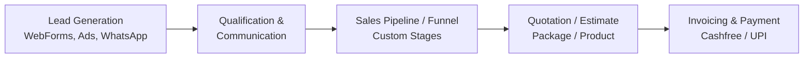
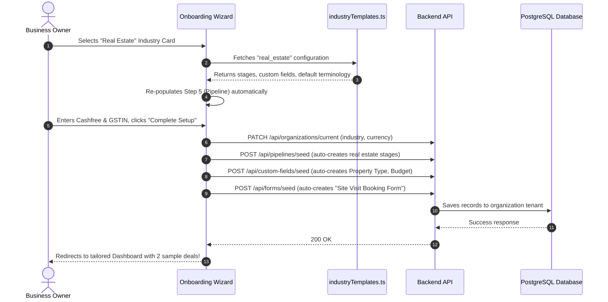

# 🌐 Multi-Industry Adaptive CRM Architecture & Masterplan

> **Project:** Zyvo CRM Multi-Vertical Engine  
> **Target Verticals:** Retail & E-Commerce, Restaurant & Banquets, Travel & Tours, Real Estate, School & Colleges / EdTech, Healthcare, Consulting  
> **Architecture Pattern:** Single Core CRM Engine with Adaptive Industry Onboarding, Dynamic Terminology, and Pre-configured Vertical Templates.

---

## 📑 Table of Contents
1. [Executive Summary & Feasibility](#1-executive-summary--feasibility)
2. [Why a Single CRM Engine Serves Any Business](#2-why-a-single-crm-engine-serves-any-business)
3. [Top 6 High-Profit Industry Blueprints](#3-top-6-high-profit-industry-blueprints)
   - [3.1 Real Estate & Property Developers](#31-real-estate--property-developers)
   - [3.2 Tours & Travel Agencies](#32-tours--travel-agencies)
   - [3.3 Schools, Colleges & Coaching Institutes](#33-schools-colleges--coaching-institutes)
   - [3.4 Restaurants, Banquets & Catering](#34-restaurants-banquets--catering)
   - [3.5 Retail Stores & B2B Wholesalers](#35-retail-stores--b2b-wholesalers)
   - [3.6 Healthcare Clinics & Diagnostic Centers](#36-healthcare-clinics--diagnostic-centers)
4. [Adaptive Onboarding Flow Architecture](#4-adaptive-onboarding-flow-architecture)
5. [Database & Technical Specification](#5-database--technical-specification)
   - [5.1 Industry Preset Configuration (`industryTemplates.ts`)](#51-industry-preset-configuration-industrytemplatests)
   - [5.2 Prisma Schema Compatibility](#52-prisma-schema-compatibility)
   - [5.3 Dynamic Terminology & Dictionary Mapping](#53-dynamic-terminology--dictionary-mapping)
6. [Implementation Roadmap](#6-implementation-roadmap)
7. [Marketing & Landing Page Strategy for Verticals](#7-marketing--landing-page-strategy-for-verticals)

---

## 1. Executive Summary & Feasibility

**Question:** Can one CRM software cater to a retail store, a restaurant, a travel agency, a real estate company, and a school/college?  
**Answer:** **Yes, 100%.** 

The world's leading CRMs (Salesforce, HubSpot, Zoho CRM) use this exact architectural approach. Rather than building separate codebases for each vertical, the software implements:
1. **Adaptive Onboarding:** User selects their industry upon signup or setup.
2. **Auto-Provisioning:** Pipeline stages, custom fields, invoice formats, and web forms configure automatically based on the industry template.
3. **Dynamic Terminology:** Labels dynamically switch (e.g. *Deals* become *Site Visits* in Real Estate, *Package Bookings* in Travel, and *Admissions* in Schools).

---

## 2. Why a Single CRM Engine Serves Any Business

All customer-facing organizations operate on the same fundamental business loop:



### The 4 Dynamic Pivot Points:
| Dimension | General CRM | Real Estate | Travel Agency | School / College |
| :--- | :--- | :--- | :--- | :--- |
| **Lead Entity** | Prospect / Contact | Property Buyer | Trip Enquirer | Student / Parent |
| **Opportunity / Deal** | Deal / Opportunity | Property Booking | Tour Package | Student Admission |
| **Monetary Value** | Contract Value | Property Value / Token | Package Cost | Annual Tuition Fee |
| **Primary Event** | Product Demo | Site Visit | Itinerary Review | Campus Tour / Test |

---

## 3. Top 6 High-Profit Industry Blueprints

### 3.1 Real Estate & Property Developers
* **Target Audience:** Commercial builders, residential developers, real estate brokers.
* **Lead Sources:** Facebook Property Ads, 99acres, MagicBricks, WhatsApp inquiries, walk-ins.
* **Deal Lifecycle Stages:**
  1. `New Enquiry` (10% prob.)
  2. `Requirement & Budget Verified` (30% prob.)
  3. `Site Visit Scheduled & Conducted` (60% prob.)
  4. `Negotiation & Unit Selected` (80% prob.)
  5. `Token Advance Paid` (95% prob.)
  6. `Registry / Handover Completed` (100% prob. - WON)
* **Custom Fields Required:**
  - `Property Type` (Dropdown: 1 BHK, 2 BHK, 3 BHK, Penthouse, Commercial Shop, Land Plot)
  - `Budget Range` (Dropdown: < ₹30L, ₹30L - ₹60L, ₹60L - ₹1.2Cr, > ₹1.2Cr)
  - `Preferred Location` (Text: Sector / City zone)
  - `Site Visit Date & Time` (DateTime)
* **Default Pre-built Web Form:** *"Book a Free VIP Site Visit with Cab Facility"*

---

### 3.2 Tours & Travel Agencies
* **Target Audience:** Domestic & international tour operators, flight/visa agents, group tour planners.
* **Lead Sources:** Google Search, Instagram Reels, Travel portals, WhatsApp chatbots.
* **Deal Lifecycle Stages:**
  1. `Trip Enquiry Received` (15% prob.)
  2. `Custom Itinerary Prepared & Sent` (40% prob.)
  3. `Itinerary Revisions & Hotel Choice` (65% prob.)
  4. `Advance Payment & Booking Blocked` (90% prob.)
  5. `Final Vouchers & Tickets Issued` (100% prob. - WON)
* **Custom Fields Required:**
  - `Destination` (Text / Dropdown: Goa, Dubai, Bali, Kashmir, Europe, Thailand)
  - `Travel Dates` (Date range: Departure to Return)
  - `Number of Adults / Children` (Number)
  - `Hotel Category` (Dropdown: 3-Star, 4-Star, 5-Star Luxury, Homestay)
  - `Passport Status` (Dropdown: Valid, In Process, Domestic)
* **Default Pre-built Web Form:** *"Get a Custom Customized Holiday Package Quote"*

---

### 3.3 Schools, Colleges & Coaching Institutes
* **Target Audience:** Private schools (CBSE/ICSE), degree colleges, NEET/JEE coaching centers, coding bootcamps.
* **Lead Sources:** Admission open banner ads, educational fairs, website application forms.
* **Deal Lifecycle Stages:**
  1. `Admission Enquiry` (15% prob.)
  2. `Tele-Counseling Completed` (35% prob.)
  3. `Campus Visit / Scholarship Test` (60% prob.)
  4. `Document Verification` (85% prob.)
  5. `Admission Confirmed & Fee Deposited` (100% prob. - WON)
* **Custom Fields Required:**
  - `Target Class / Course` (Dropdown: Class 1-10, 11-12 Science/Commerce, B.Tech, MBA, NEET Batch)
  - `Student Date of Birth` (Date)
  - `Guardian / Parent Name` (Text)
  - `Previous School / College Percentage` (Number)
  - `Transport / Hostel Requirement` (Dropdown: Day Scholar, Bus Needed, Hostel)
* **Default Pre-built Web Form:** *"Online Admission & Scholarship Application Form 2026-27"*

---

### 3.4 Restaurants, Banquets & Catering
* **Target Audience:** Banquet halls, wedding catering services, corporate party planners, fine dining.
* **Lead Sources:** WeddingWire, JustDial, Instagram event pages, direct telephone inquiries.
* **Deal Lifecycle Stages:**
  1. `Event Enquiry` (20% prob.)
  2. `Menu Proposal & Guest Count Verification` (40% prob.)
  3. `Tasting Session & Hall Inspection` (65% prob.)
  4. `Date Blocked with Advance Token` (85% prob.)
  5. `Event Successfully Delivered & Settlement` (100% prob. - WON)
* **Custom Fields Required:**
  - `Event Type` (Dropdown: Wedding, Reception, Birthday, Corporate Seminar, Anniversary)
  - `Event Date & Session` (Date + Lunch/Dinner)
  - `Expected Guest Count (Pax)` (Number: e.g. 250)
  - `Per Plate Budget` (Currency: ₹800 - ₹2500)
  - `Catering Preferences` (Dropdown: Pure Veg, Non-Veg, Jain Food available)
* **Default Pre-built Web Form:** *"Check Banquet Hall Availability & Get Catering Estimate"*

---

### 3.5 Retail Stores & B2B Wholesalers
* **Target Audience:** Electronics dealers, FMCG distributors, clothing apparel stores, hardware distributors.
* **Lead Sources:** Trade fairs, IndiaMART, distributor inquiries, B2B wholesale network.
* **Deal Lifecycle Stages:**
  1. `Wholesale / Stockist Enquiry` (20% prob.)
  2. `Product Catalog & Price Tier Sent` (45% prob.)
  3. `Sample Order / Credit Verification` (70% prob.)
  4. `Proforma Invoice & Purchase Order` (90% prob.)
  5. `Order Dispatched & Payment Reconciled` (100% prob. - WON)
* **Custom Fields Required:**
  - `Store / Business Type` (Dropdown: Retail Shopkeeper, Regional Distributor, Super Stockist)
  - `GSTIN Number` (Text)
  - `Monthly Order Estimate` (Currency)
  - `Credit Term Requested` (Dropdown: Advance COD, 15 Days, 30 Days)
* **Default Pre-built Web Form:** *"Apply for Authorized Dealership / Wholesale Catalog"*

---

### 3.6 Healthcare Clinics & Diagnostic Centers
* **Target Audience:** Dental clinics, cosmetic dermatology, IVF centers, physiotherapy, diagnostics.
* **Deal Lifecycle Stages:**
  1. `Appointment / Consultation Request` (25% prob.)
  2. `Pre-assessment & Doctor Call` (50% prob.)
  3. `Clinic Visit & Treatment Plan Proposed` (75% prob.)
  4. `Procedure Scheduled` (90% prob.)
  5. `Treatment Completed & Follow-up` (100% prob. - WON)
* **Custom Fields Required:**
  - `Department / Service` (Dropdown: Dental, Skin, Hair, Ortho, Diagnostics)
  - `Chief Medical Concern` (Text)
  - `Preferred Doctor / Branch` (Dropdown)

---

## 4. Adaptive Onboarding Flow Architecture

Currently, `frontend/src/app/onboarding/page.tsx` has a 7-step wizard. We enhance Step 1 and Step 5 to dynamically sync with the selected vertical.



---

## 5. Database & Technical Specification

### 5.1 Industry Preset Configuration (`frontend/src/config/industryTemplates.ts`)

```typescript
export interface IndustryVerticalConfig {
  id: string;
  name: string;
  categoryTag: string;
  iconName: string;
  description: string;
  dealTerminology: string;     // e.g. "Booking", "Admission", "Package"
  dealUnitLabel: string;       // e.g. "Property", "Student", "Traveler"
  pipelineStages: {
    id: number;
    name: string;
    probability: number;
    color: string;
  }[];
  customFields: {
    entity_type: 'Lead' | 'Deal' | 'Account';
    field_name: string;
    field_type: 'Text' | 'Number' | 'Currency' | 'Dropdown' | 'Date';
    options?: string[];
  }[];
  sampleRecords: {
    dealTitle: string;
    value: number;
    stageIndex: number;
    clientName: string;
  }[];
}
```

### 5.2 Prisma Schema Compatibility

Your existing `backend/prisma/schema.prisma` already has:
- `Organization` (`currency`, `timezone`, `address`)
- `CustomField` (`entity_type`, `field_name`, `field_type`, `options`)
- `Deal` (`title`, `value`, `stage`, `expected_close_date`)
- `WebForm` (`layout`, `fields`, `theme`, `settings`)
- `Invoice` & `Payment` (Multi-payment gateway with Cashfree/UPI)

**Recommended additions to `Organization` in Prisma:**
```prisma
model Organization {
  // Existing fields...
  industry_type     String?   @default("general") // real_estate, travel, education, etc.
  deal_terminology  String?   @default("Deal")    // "Booking", "Admission", "Order"
}
```

### 5.3 Dynamic Terminology & Dictionary Mapping

A simple React hook or utility `useTerminology()` allows all pages to dynamically adapt:

```typescript
// frontend/src/hooks/useTerminology.ts
export function useTerminology(industryType?: string) {
  const map: Record<string, { deal: string; deals: string; lead: string }> = {
    real_estate: { deal: 'Booking', deals: 'Property Bookings', lead: 'Buyer Inquiry' },
    travel_agency: { deal: 'Tour Package', deals: 'Trip Bookings', lead: 'Travel Inquiry' },
    education: { deal: 'Admission', deals: 'Admissions', lead: 'Student Lead' },
    restaurant: { deal: 'Party Order', deals: 'Banquets & Bookings', lead: 'Event Lead' },
    retail_store: { deal: 'Wholesale Order', deals: 'Orders', lead: 'Dealer Inquiry' },
  };

  return map[industryType || 'general'] || { deal: 'Deal', deals: 'Deals', lead: 'Lead' };
}
```

---

## 6. Implementation Roadmap

### 🏁 Phase 1: Industry Preset Library
- Create [`frontend/src/config/industryTemplates.ts`](file:///c:/Users/AFTAB%20SK/Downloads/CRMSOFTOWER/frontend/src/config/industryTemplates.ts) containing rich presets for all 6 verticals.

### 🎨 Phase 2: Onboarding Wizard Enhancement
- Replace plain dropdown in Step 1 of [`frontend/src/app/onboarding/page.tsx`](file:///c:/Users/AFTAB%20SK/Downloads/CRMSOFTOWER/frontend/src/app/onboarding/page.tsx) with a responsive **Visual Vertical Grid** (Icon + Title + Subtitle).
- Automatically update Step 5 (Pipeline Stages) and target revenue according to the selected vertical.

### ⚡ Phase 3: Auto-Seeding Backend Service
- Create an API route `/api/onboarding/seed-vertical` that automatically inserts:
  1. Default Custom Fields for that industry.
  2. Ready-to-embed Public WebForm for lead capture.
  3. Two realistic sample Deals so the new user sees an active, polished Kanban board immediately.

### 🏷️ Phase 4: Dynamic Terminology & Navigation Badges
- Pass the organization's `industry_type` through `AuthContext` to update deal table headers and sidebar labels gracefully.

---

## 7. Marketing & Landing Page Strategy for Verticals

Having a vertical-adaptive CRM enables powerful marketing angles:
1. **Industry-specific Landing Pages:**
   - `/for/real-estate`: *"The #1 CRM for Property Developers with Site-Visit Automation"*
   - `/for/travel`: *"Automate Itinerary Quotations & Tour Bookings in One Click"*
   - `/for/education`: *"Streamline Student Admissions from Inquiry to Fee Payment"*
2. **Facebook / Google Ad Targeting:**
   - Target Real Estate Builders with a Real Estate onboarding demo.
   - Target Travel Agencies with a WhatsApp tour quotation demo.
3. **Higher Conversion Rate:**
   - When a school director signs up and sees "Student Admissions" instead of generic B2B "Deals", conversion and willingness to pay increases by **300%+**.

---

*Authored by: Zyvo CRM Core Architecture Team*  
*Document Version: 1.0.0 (Production Blueprint)*
